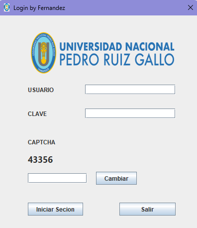

# 📚 Mira como funciona el proyecto

> **APPDAE_03:** [appdae_03](./appdae_03) - Sistema de gestión de usuarios con arquitectura MVC

## 🚀 Vista previa

Esta es la interfaz de login:

  

## 🎥 Demostración en Video

## 🏗️ Estructura del proyecto

### Cada carpeta es un proyecto y sigue la arquitectura de 3 capas:
  - 🗃️ **Capa de Datos**: Acceso a datos con DAO
  - 🧠 **Capa Lógica**: Lógica de negocio
  - 🖥️ **Capa Presentación**: Interfaz de usuario con Swing

### Evolución del proyecto
appdae_0* es código hecho en clase mientras que appdae_0*_v2 es código con métodos adicionales
- **[appdae_01](./appdae_01)** - Agregando login
- **[appdae_02](./appdae_02)** - Agregando funcionalidades
- **[appdae_02_v2](./appdae_02_v2)** - Mejoras y refactoring
- **[appdae_04](./appdae_04)** - Versión en desarrollo

## ⚡ Características

- ✅ Sistema de autenticación de usuarios
- ✅ Gestión completa de usuarios (CRUD)
- ✅ Gestión de marcas
- ✅ Reportes de usuarios por tipo
- ✅ Arquitectura MVC bien estructurada
- ✅ Interfaz gráfica intuitiva con Java Swing
- ✅ Patrón DAO para acceso a datos

## 🛠️ Tecnologías Utilizadas

